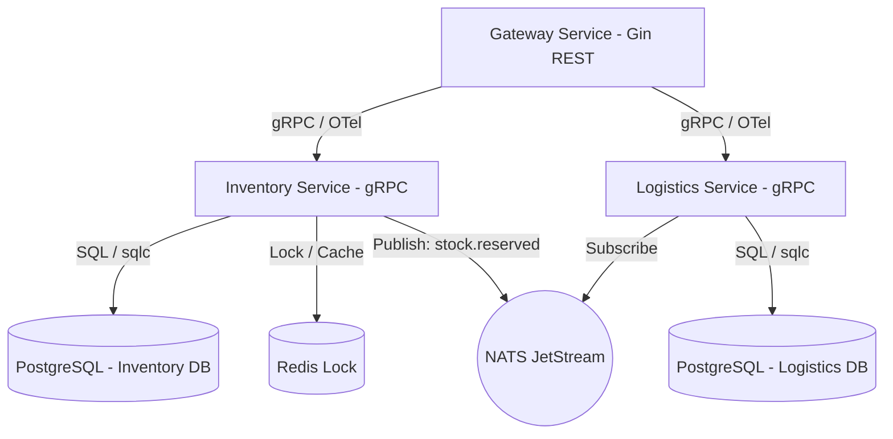

# Plan: Distributed Warehouse & Logistics API

This document outlines the step-by-step implementation plan for building the Distributed Warehouse & Logistics API.

## Major Components & Dependencies

## Implementation Phases & Order

### Phase 1: Infrastructure & Shared Code (Prerequisites)
- Set up `docker-compose.yml` containing PostgreSQL (2 databases: `inventory` & `logistics`), Redis, NATS, Grafana, Prometheus, Loki, Jaeger.
- Initialize Go module (`go mod init`).
- Configure Protocol Buffers (`.proto` files) for cross-service gRPC communication.
- Set up shared libraries: configuration loader, NATS client helper, OpenTelemetry initializer.

### Phase 2: Inventory Service (Core Store)
- Set up database migrations for users, warehouses, items, stock levels, and transaction ledgers.
- Implement database queries and compile them using `sqlc`.
- Implement gRPC server handlers.
- Integrate Redis lock via `redsync` to manage reservations.
- Integrate NATS publishing logic.

### Phase 3: Logistics Service (Downstream Store)
- Set up database migrations for shipments.
- Implement database queries and compile them using `sqlc`.
- Implement gRPC server handlers.
- Implement NATS subscription to consume `stock.reserved` events and auto-schedule shipments.

### Phase 4: API Gateway & Auth
- Set up Gin HTTP endpoints for User Register/Login (generating access/refresh tokens).
- Implement middleware for JWT verification and OpenTelemetry trace propagation.
- Implement HTTP handlers calling Inventory and Logistics gRPC backends.

### Phase 5: Observability & Traces
- Configure Prometheus metrics, Loki log forwarders, and Jaeger tracing exports.
- Connect everything in a Grafana dashboard.

### Phase 6: Load Simulator & Verification
- Create a simulator script that generates fake customer traffic, orders items, and creates high concurrency race conditions (testing Redis locks).
- Verify dashboard outputs and visual tracing in Jaeger.

---

## Risks & Mitigation Strategies

| Risk | Impact | Mitigation |
|---|---|---|
| Race conditions in Inventory reservation | High (Overselling stock) | Use Redis distributed locking (`redsync`) around the reservation transaction. |
| Event loss (NATS server restart) | Medium | Enable NATS JetStream durability so events are persisted and re-delivered if consumers are down. |
| Missing Traces across services | Low (Hard to debug) | Force trace ID propagation inside gRPC metadata wrappers using OpenTelemetry gRPC interceptors. |

---

## Verification Checkpoints

1. **Checkpoint 1 (Proto & DB)**: Both databases are running, migrations are applied, and protobuf generates code without errors.
2. **Checkpoint 2 (gRPC Connection)**: Gateway can authenticate a user and communicate with Inventory and Logistics over gRPC.
3. **Checkpoint 3 (Event Delivery)**: Placing an order publishes a NATS event which is successfully caught by the Logistics service.
4. **Checkpoint 4 (Visual Proof)**: Running the simulator populates Grafana dashboards and Jaeger shows complete end-to-end trace flows.
